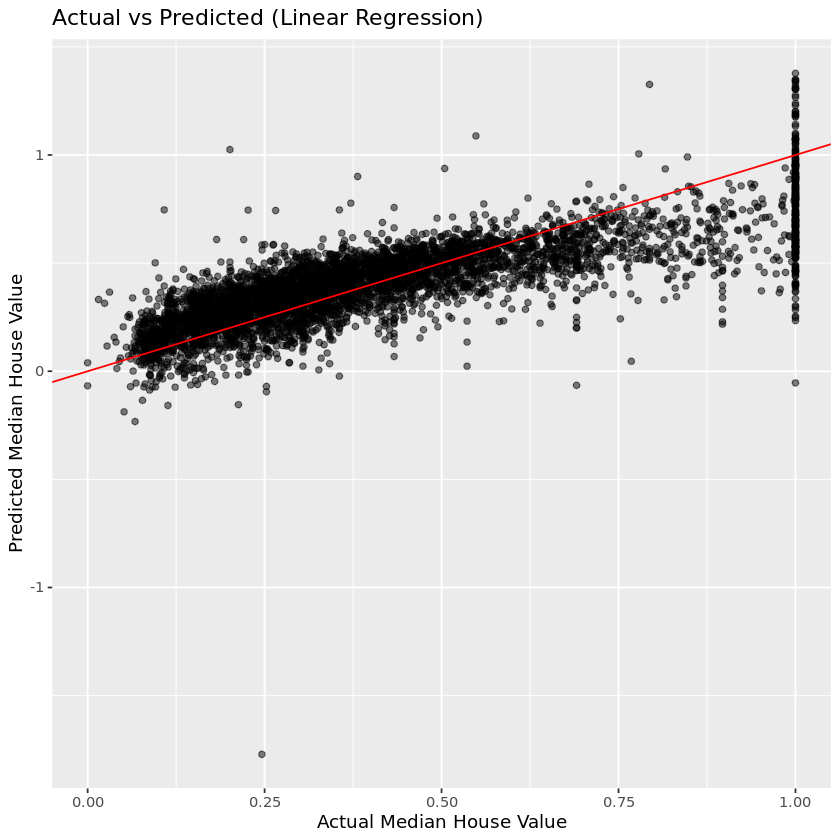
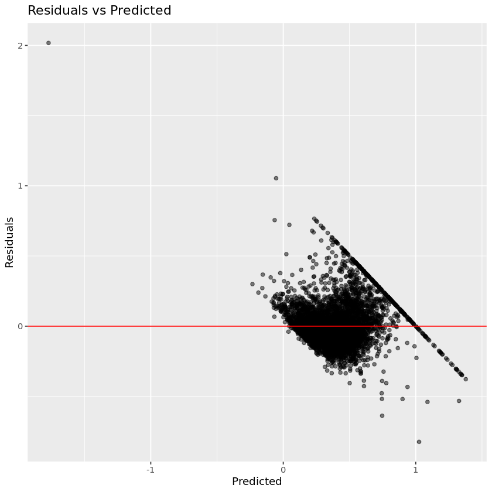
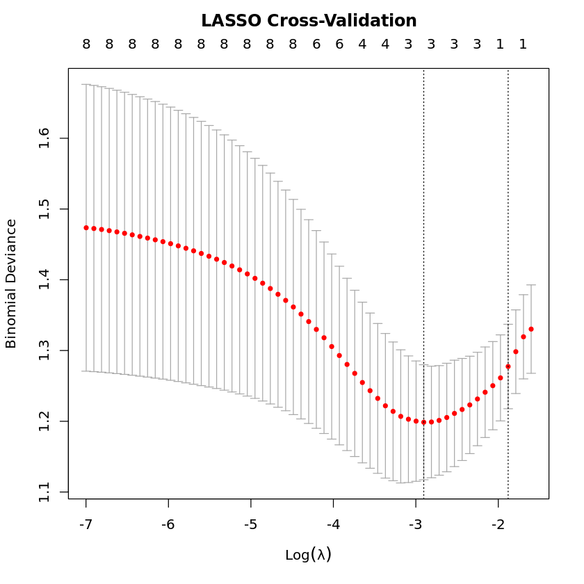

# Homework 09
Bella Williams

## Question 1
#### In the table below, fill in the definition column with a short (no more than two sentence) definition for each vocab word. If it can be summarized by a formula, give the formula. 

| Vocab Word | Definition |
|:--------|:--------|
| **One-hot coding** | This method transforms unique values from a single variable into a new, separate binary variable column. |
| **Feature selection*** | A process of automatically identifying and selecting the most important/relevant variables in the data. |
| **Classifier** | A type of model that assigns inputs to predefined categories instead of predicting continuous numerical values. |
| **Precision** | precision = true positives / (true positives + false positives)|
| **Recall** | recall = true positives / (true positives + false negatives) |
| **F1 Score** | 2 * (precision*recall)/(precision+recall) |
| **Parsimonious model** | A statistical model that aims to achieve good predictive performance while using the fewest possible parameters. The product will be as simple as possible while still explaining the data well. |
| **Ridge regression** | A type of regression that adds a penalty proportional to the sum of the squared coefficients. This makes the model more stable.|
| **LASSO regression** | A type of regression that adds a penalty proportional to the sum of the absolute values of the coefficients. |
| **Cross validation** | A statistical technique used to assess how well a model will generalize to an independent dataset and reliably compare the performance of different models.|
| **Tree based methods** | A category of machine learning model that uses a decision-tree structure to make predictions, offering an alternative to linear models. |

*Just give the general idea.

## Question 2 
#### a) What shape does a perfect classifier look like on an ROC curve? What about a bad classifier?

A perfect classifier looks like a rectangle on an ROC curve. A perfectly bad classifier looks like a diagonal line (y=x). 

#### b) Think about the formula for an F1 score. What does it mean when the F1 score is close to 1? Close to 0?

When the F1 score is close to 1 it means that the classifier is performing extremely well with high precision and high recall. An F1 score close to 0 means the classifier is performing very poorly with low precision, low recall, or both. 

## Question 3
#### Compare the following aspects of linear vs. logistic regression.
|  | Linear | Logistic |
|:--------|:--------|:--------|
| **Chart Shape** | straight line | sigmoid s-curve |
| **Dependent Variable Type** | continuous | categorical/binary |
| **Purpose** (regression or classification) | regression | classification |
| **Range of output variable** ($y_i$ or $p_i$) | yi | pi |
| **Method*** | ordinary least squares | maximum likelihood estimation |
| **Example of use** | predict mileage of a car based on engine size | predict whether a stroke will occur (yes/no) |  
  
*Meaning ordinary least squares or maximum likelihood estimation

## Question 4
#### Why is it important to train then test our model? How do we do that? (2-3 sentences. Not looking for code, just general explanation).

We need a way to evaluate how well a model will perform of new, unseen data and provide cross validation. The data is first prepared using one-hot encoding, then split into a training and a testing set. Regression/classification tests are performed on the training data before the model is finally tested to evaluate the model's performance. 

## Question 5
This question runs through a linear regression example. We want to predict median house value based on the other variables.
#### a) First, load the `housing.csv` data set. Look at the data in some useful way. Why is linear regression appropriate here?


```R
library(tidyverse)
```


```R
d <-read_csv("housing.csv")

cat("--- Structure of the Data ---\n")
str(d)
```

    Rows: 20640 Columns: 8
    ── Column specification ────────────────────────────────────────────────────────
    Delimiter: ","
    dbl (8): longitude, latitude, housing_median_age, total_rooms, population, h...
    
    ℹ Use `spec()` to retrieve the full column specification for this data.
    ℹ Specify the column types or set `show_col_types = FALSE` to quiet this message.


    --- Structure of the Data ---
    spc_tbl_ [20,640 × 8] (S3: spec_tbl_df/tbl_df/tbl/data.frame)
     $ longitude         : num [1:20640] -122 -122 -122 -122 -122 ...
     $ latitude          : num [1:20640] 37.9 37.9 37.9 37.9 37.9 ...
     $ housing_median_age: num [1:20640] 41 21 52 52 52 52 52 52 42 52 ...
     $ total_rooms       : num [1:20640] 880 7099 1467 1274 1627 ...
     $ population        : num [1:20640] 322 2401 496 558 565 ...
     $ households        : num [1:20640] 126 1138 177 219 259 ...
     $ median_income     : num [1:20640] 8.33 8.3 7.26 5.64 3.85 ...
     $ median_house_value: num [1:20640] 452600 358500 352100 341300 342200 ...
     - attr(*, "spec")=
      .. cols(
      ..   longitude = col_double(),
      ..   latitude = col_double(),
      ..   housing_median_age = col_double(),
      ..   total_rooms = col_double(),
      ..   population = col_double(),
      ..   households = col_double(),
      ..   median_income = col_double(),
      ..   median_house_value = col_double()
      .. )
     - attr(*, "problems")=<externalptr> 


#### b) Scale data and split it 75/25 training/testing. Set seed = 123.


```R
scale <- function(a){
  (a - min(a))/(max(a)-min(a))
}

housing_s <- d %>% select(where(is.numeric)) %>%
  mutate(across(where(is.numeric), scale))

set.seed(123)
train <- runif(nrow(housing_s)) < 0.75
test <- !train
```

#### c) Fit the model.


```R
fit = median_house_value ~ longitude + latitude + housing_median_age +
  total_rooms + population + households + median_income

model <- lm(fit, data=housing_s %>% filter(train))
summary(model)
```


    
    Call:
    lm(formula = fit, data = housing_s %>% filter(train))
    
    Residuals:
         Min       1Q   Median       3Q      Max 
    -1.11495 -0.09080 -0.02335  0.06400  1.00888 
    
    Coefficients:
                        Estimate Std. Error t value Pr(>|t|)    
    (Intercept)         0.728806   0.015356   47.46   <2e-16 ***
    longitude          -0.868215   0.016894  -51.39   <2e-16 ***
    latitude           -0.817586   0.015007  -54.48   <2e-16 ***
    housing_median_age  0.122501   0.005194   23.59   <2e-16 ***
    total_rooms        -0.065063   0.065076   -1.00    0.317    
    population         -3.526248   0.092512  -38.12   <2e-16 ***
    households          1.967049   0.062952   31.25   <2e-16 ***
    median_income       1.143536   0.010837  105.52   <2e-16 ***
    ---
    Signif. codes:  0 ‘***’ 0.001 ‘**’ 0.01 ‘*’ 0.05 ‘.’ 0.1 ‘ ’ 1
    
    Residual standard error: 0.1425 on 15556 degrees of freedom
    Multiple R-squared:  0.6399,	Adjusted R-squared:  0.6397 
    F-statistic:  3948 on 7 and 15556 DF,  p-value: < 2.2e-16


#### d) Make predictions on test data and show them in an actual vs. predicted plot.


```R
dx <- housing_s[test, ]

dx <- dx %>%
  mutate(median_house_value_pred = predict(model, newdata = dx))

ggplot(dx, aes(x = median_house_value, y = median_house_value_pred)) +
  geom_point(alpha = 0.5) +
  geom_abline(slope = 1, intercept = 0, color = "red") +
  labs(title = "Actual vs Predicted (Linear Regression)",
       x = "Actual Median House Value",
       y = "Predicted Median House Value")
```


    

    


#### e) Make a residuals plot.


```R
ggplot(dx, aes(x = median_house_value_pred, y = median_house_value - median_house_value_pred)) +
  geom_point(alpha = 0.5) +
  geom_hline(yintercept = 0, color = "red") +
  labs(title = "Residuals vs Predicted", x = "Predicted", y = "Residuals")
```


    

    


## Question 6
This question runs through a logistic regression example. We want to predict diabetes diagnosis based on the other variables. 
#### a) First, load the `diabetes.csv` data set. Look at the data in some useful way. Why is logistic regression appropriate here?


```R
d <- read_csv("diabetes.csv")
cat("--- Structure of the Data ---\n")
str(d)
```

    Rows: 768 Columns: 9
    ── Column specification ────────────────────────────────────────────────────────
    Delimiter: ","
    dbl (9): Pregnancies, Glucose, BloodPressure, SkinThickness, Insulin, BMI, D...
    
    ℹ Use `spec()` to retrieve the full column specification for this data.
    ℹ Specify the column types or set `show_col_types = FALSE` to quiet this message.


    --- Structure of the Data ---
    spc_tbl_ [768 × 9] (S3: spec_tbl_df/tbl_df/tbl/data.frame)
     $ Pregnancies             : num [1:768] 6 1 8 1 0 5 3 10 2 8 ...
     $ Glucose                 : num [1:768] 148 85 183 89 137 116 78 115 197 125 ...
     $ BloodPressure           : num [1:768] 72 66 64 66 40 74 50 0 70 96 ...
     $ SkinThickness           : num [1:768] 35 29 0 23 35 0 32 0 45 0 ...
     $ Insulin                 : num [1:768] 0 0 0 94 168 0 88 0 543 0 ...
     $ BMI                     : num [1:768] 33.6 26.6 23.3 28.1 43.1 25.6 31 35.3 30.5 0 ...
     $ DiabetesPedigreeFunction: num [1:768] 0.627 0.351 0.672 0.167 2.288 ...
     $ Age                     : num [1:768] 50 31 32 21 33 30 26 29 53 54 ...
     $ Outcome                 : num [1:768] 1 0 1 0 1 0 1 0 1 1 ...
     - attr(*, "spec")=
      .. cols(
      ..   Pregnancies = col_double(),
      ..   Glucose = col_double(),
      ..   BloodPressure = col_double(),
      ..   SkinThickness = col_double(),
      ..   Insulin = col_double(),
      ..   BMI = col_double(),
      ..   DiabetesPedigreeFunction = col_double(),
      ..   Age = col_double(),
      ..   Outcome = col_double()
      .. )
     - attr(*, "problems")=<externalptr> 


#### b) Scale data and split it 75/25 training/testing. Set seed = 123.


```R
scale <- function(a){
  (a - min(a))/(max(a)-min(a))
}

diabetes_s <- d %>% select(where(is.numeric)) %>%
  mutate(across(where(is.numeric), scale))

set.seed(123)
n <- nrow(diabetes_s)
train_idx <- sample.int(n, size = floor(0.1 * n))
d_train <- diabetes_s %>% slice(train_idx)
d_test  <- diabetes_s %>% slice(setdiff(seq_len(n), train_idx))

d_train %>% write_csv("diabetes_train.csv")
d_test  %>% write_csv("diabetes_test.csv")
```

#### c) Fit the model.


```R
fit <- Outcome ~ .
model <- glm(fit, data = d_train, family = binomial())

summary(model)
```


    
    Call:
    glm(formula = fit, family = binomial(), data = d_train)
    
    Coefficients:
                             Estimate Std. Error z value Pr(>|z|)    
    (Intercept)               -8.2848     2.3250  -3.563 0.000366 ***
    Pregnancies                1.8716     1.5354   1.219 0.222848    
    Glucose                    5.0362     2.1896   2.300 0.021446 *  
    BloodPressure              0.2239     2.3883   0.094 0.925307    
    SkinThickness              1.4403     2.3091   0.624 0.532776    
    Insulin                   -1.2769     2.0595  -0.620 0.535259    
    BMI                        7.2613     4.2227   1.720 0.085507 .  
    DiabetesPedigreeFunction   0.7208     1.9228   0.375 0.707739    
    Age                        1.0054     1.8917   0.531 0.595091    
    ---
    Signif. codes:  0 ‘***’ 0.001 ‘**’ 0.01 ‘*’ 0.05 ‘.’ 0.1 ‘ ’ 1
    
    (Dispersion parameter for binomial family taken to be 1)
    
        Null deviance: 98.898  on 75  degrees of freedom
    Residual deviance: 76.074  on 67  degrees of freedom
    AIC: 94.074
    
    Number of Fisher Scoring iterations: 5


#### d) Make predictions on test data. Print a table with the number of true positives, false positives, true negatives, false negatives, and accuracy. 


```R
p <- predict(model, newdata = d_test, type = "response")
pred <- as.integer(p >= 0.5)
truth <- d_test$Outcome

tp <- sum(pred == 1 & truth == 1)
fp <- sum(pred == 1 & truth == 0)
tn <- sum(pred == 0 & truth == 0)
fn <- sum(pred == 0 & truth == 1)
acc <- (tp + tn) / (tp + fp + tn + fn)

df <- tibble(
  measure = c("True Positive", "False Positive", "True Negative", "False Negative", "Accuracy"),
  value   = c(tp, fp, tn, fn, acc)
)

df
```


<table class="dataframe">
<caption>A tibble: 5 × 2</caption>
<thead>
	<tr><th scope=col>measure</th><th scope=col>value</th></tr>
	<tr><th scope=col>&lt;chr&gt;</th><th scope=col>&lt;dbl&gt;</th></tr>
</thead>
<tbody>
	<tr><td>True Positive </td><td>147.0000000</td></tr>
	<tr><td>False Positive</td><td> 72.0000000</td></tr>
	<tr><td>True Negative </td><td>379.0000000</td></tr>
	<tr><td>False Negative</td><td> 94.0000000</td></tr>
	<tr><td>Accuracy      </td><td>  0.7601156</td></tr>
</tbody>
</table>


#### e) Fit a LASSO-regularized logistic regression model. Again, set seed = 123. Which variables are the most important (which ones don't go to zero)? How does the LASSO model affect the accuracy?


```R
install.packages("glmnet")
```

    Installing package into ‘/srv/rlibs’
    (as ‘lib’ is unspecified)
    


```R
library(glmnet)
```


```R
x_train <- model.matrix(Outcome ~ ., d_train)[, -1]
y_train <- d_train$Outcome
x_test  <- model.matrix(Outcome ~ ., d_test)[, -1]
y_test  <- d_test$Outcome

set.seed(123)
cv_lasso <- cv.glmnet(x_train, y_train, alpha = 1, family = "binomial")

plot(cv_lasso)
title("LASSO Cross-Validation", line = 2.5)

cv_lasso$lambda.min

coef(cv_lasso, s = "lambda.min")

lasso_pred_prob <- predict(cv_lasso, newx = x_test, s = "lambda.min", type = "response")
lasso_pred <- as.integer(lasso_pred_prob >= 0.5)

tp <- sum(lasso_pred == 1 & y_test == 1)
fp <- sum(lasso_pred == 1 & y_test == 0)
tn <- sum(lasso_pred == 0 & y_test == 0)
fn <- sum(lasso_pred == 0 & y_test == 1)
acc <- (tp + tn) / (tp + fp + tn + fn)

tibble(
  measure = c("True Positive", "False Positive", "True Negative", "False Negative", "Accuracy"),
  value   = c(tp, fp, tn, fn, acc)
)
```


0.0548083294377478


    9 x 1 sparse Matrix of class "dgCMatrix"
                                    s1
    (Intercept)              -4.653919
    Pregnancies               1.073443
    Glucose                   3.455152
    BloodPressure             .       
    SkinThickness             .       
    Insulin                   .       
    BMI                       3.507260
    DiabetesPedigreeFunction  .       
    Age                       .       


<table class="dataframe">
<caption>A tibble: 5 × 2</caption>
<thead>
	<tr><th scope=col>measure</th><th scope=col>value</th></tr>
	<tr><th scope=col>&lt;chr&gt;</th><th scope=col>&lt;dbl&gt;</th></tr>
</thead>
<tbody>
	<tr><td>True Positive </td><td>120.0000000</td></tr>
	<tr><td>False Positive</td><td> 31.0000000</td></tr>
	<tr><td>True Negative </td><td>420.0000000</td></tr>
	<tr><td>False Negative</td><td>121.0000000</td></tr>
	<tr><td>Accuracy      </td><td>  0.7803468</td></tr>
</tbody>
</table>


    

    


#### f) Make a plot of actual vs. predicted values for the LASSO model.


```R
ggplot(data.frame(y_test, lasso_pred_prob),
       aes(x = lasso_pred_prob, y = y_test)) +
  geom_jitter(height = 0.05, alpha = 0.5) +
  geom_smooth(method = "loess", se = FALSE, color = "blue") +
  labs(title = "Actual vs Predicted Probabilities (LASSO)",
       x = "Predicted Probability", y = "Actual Outcome")
```

    `geom_smooth()` using formula = 'y ~ x'


    

    

